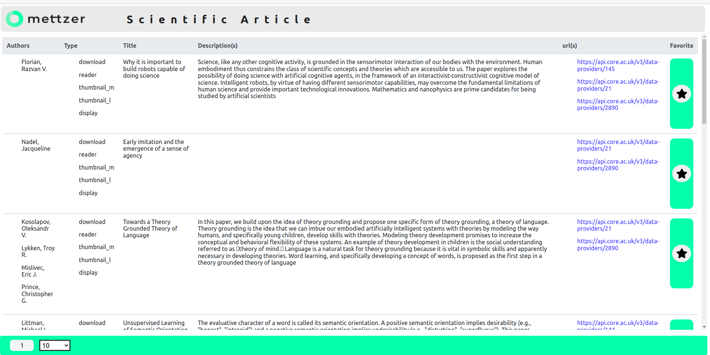

<h3> Projeto: Artigos Científicos</h3>

Implementar uma aplicação utilizando frameworks JS, que oferece uma interface web

<h4>Link Deploy:</h4>
<a href="3">Link da aplicação no heroku aqui!</a>

<h4>Especificações</h4>
<ol>
    <li>Deve ser possível buscar por artigos científicos na API do portal CORE;</li>
      <li>Deve ser possível marcar/desmarcar os resultados da pesquisa como favorito;</li>
      <li>Deve ser possível buscar por artigos científicos na API do portal CORE;</li>
      <li>Deve ter uma listagem com os artigos favoritados e ela deve estar disponível mesmo
que a janela do navegador seja fechada e aberta novamente;</li>
      <li>As listagens, tanto da pesquisa quanto dos favoritos, devem ter paginação;</li>
</ol>

<h4>O que será avaliado:</h4>
<ol>
    <li>Funcionalidade / Usabilidade;</li>
      <li>Código Limpo, de fácil entendimento, de fácil extensão;</li>
      <li>Capacidade de aprendizado;</li>
      <li>Forma de raciocínio;</li>
      <li>Criatividade;</li>
</ol>

#### Research Source:

<strong>🔗 Links Importantes</strong>
 

<a href="https://api.core.ac.uk/v3/search/works?apiKey=gStcq4C7GFURIwHQNryKTn9osuJ6DA5h">API CORE</a>

<a href="https://www.youtube.com/watch?v=IC71Y214Xcc">Mudanças React Router DOM </a>

<a href="https://www.elastic.co/guide/en/elasticsearch/reference/1.4/search-search.html">API CORE Query </a>

<a href="https://www.youtube.com/watch?v=YSlzQlEqTBg">Pagination</a>

<a href="https://www.freecodecamp.org/news/how-to-use-localstorage-with-react-hooks-to-set-and-get-items/">Freecodecamp</a>

<a href="https://www.youtube.com/watch?v=g42RRTPJFNg">Adicionando ao Array Hooks</a>

