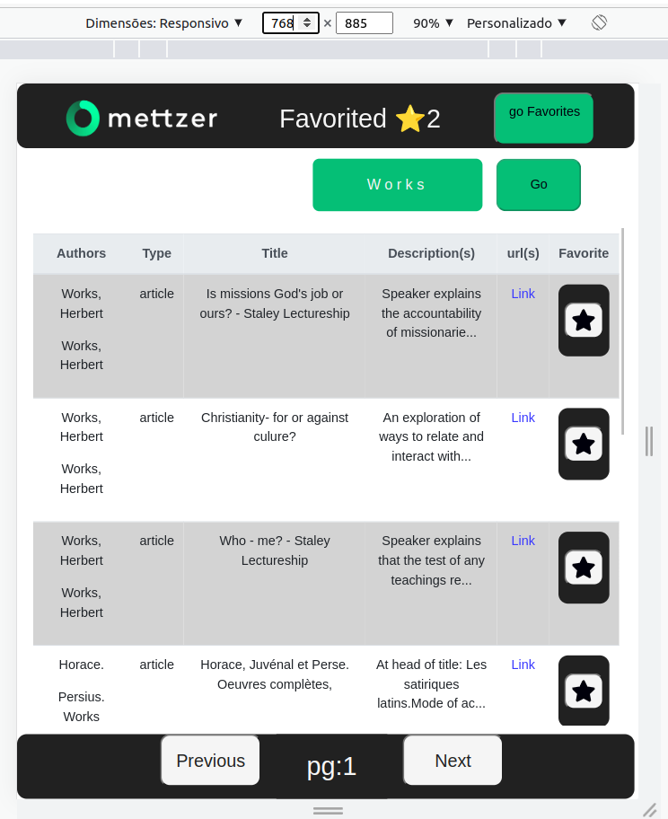
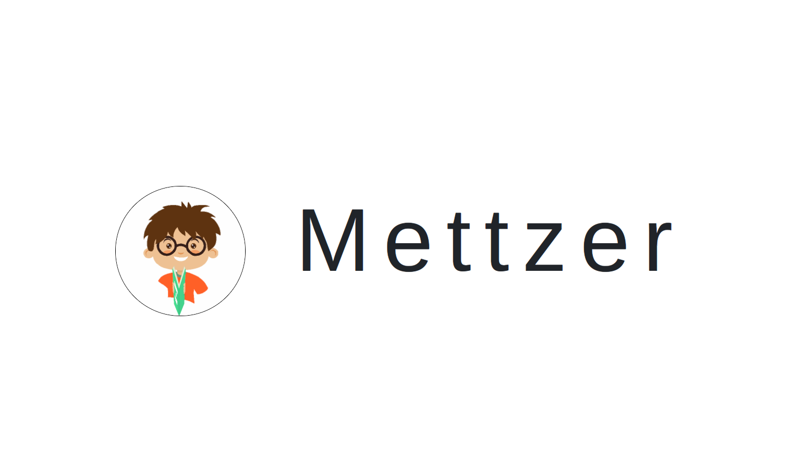
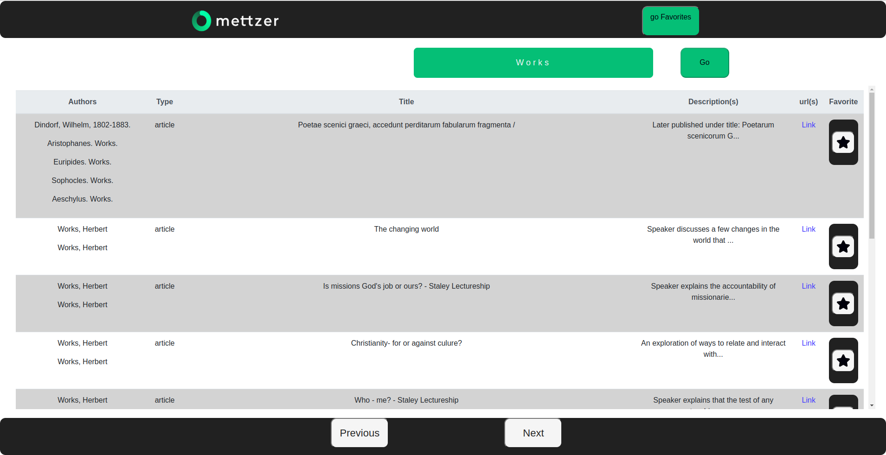
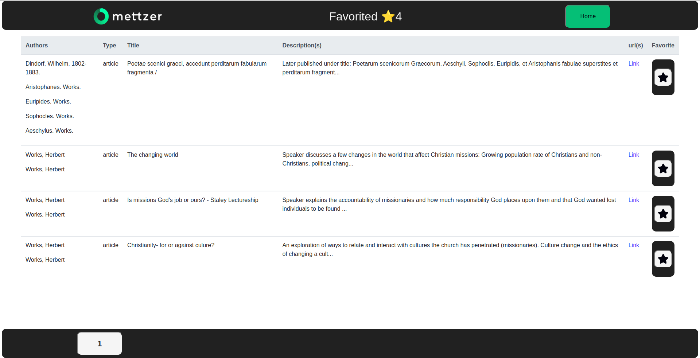

<h3> Projeto: Artigos Científicos</h3>

Implementar uma aplicação utilizando frameworks JS, que oferece uma interface web

<h4>Link Deploy:</h4>
<a href="https://mettzer-scientific-article.vercel.app/">Link Aplicação</a>
<h4>Especificações</h4>
<ol>
    <li>Deve ser possível buscar por artigos científicos na API do portal CORE;</li>
      <li>Deve ser possível marcar/desmarcar os resultados da pesquisa como favorito;</li>
      <li>Deve ser possível buscar por artigos científicos na API do portal CORE;</li>
      <li>Deve ter uma listagem com os artigos favoritados e ela deve estar disponível mesmo
que a janela do navegador seja fechada e aberta novamente;</li>
      <li>As listagens, tanto da pesquisa quanto dos favoritos, devem ter paginação;</li>
</ol>

<h4>O que será avaliado:</h4>
<ol>
    <li>Funcionalidade / Usabilidade;</li>
      <li>Código Limpo, de fácil entendimento, de fácil extensão;</li>
      <li>Capacidade de aprendizado;</li>
      <li>Forma de raciocínio;</li>
      <li>Criatividade;</li>
</ol>

#### Fonte de pesquisa:

<strong>🔗 Links Importantes</strong>
 

<a href="https://www.youtube.com/watch?v=o59EnbaSQ14">Manipulando valores de uma formulario com useState</a>

<a href="https://www.youtube.com/watch?v=jcc9T-5inrk">React Hooks</a>

<a href="https://www.youtube.com/watch?v=KJE4LtAxLEw">DotEnv</a>

<a href="https://api.core.ac.uk/v3/search/works?apiKey=gStcq4C7GFURIwHQNryKTn9osuJ6DA5h">API CORE</a>

<a href="https://www.youtube.com/watch?v=IC71Y214Xcc">Mudanças React Router DOM </a>

<a href="https://www.elastic.co/guide/en/elasticsearch/reference/1.4/search-search.html">API CORE Query </a>

<a href="https://www.youtube.com/watch?v=YSlzQlEqTBg">Pagination</a>

<a href="https://www.freecodecamp.org/news/how-to-use-localstorage-with-react-hooks-to-set-and-get-items/">Freecodecamp</a>

<a href="https://www.youtube.com/watch?v=g42RRTPJFNg">Adicionando ao Array Hooks</a>

#### Imagem das Telas:

<strong>💁‍♂️ Click/Estender</strong>
 

- [x] - Tela de Apresentação (Splash)

- [x] - Tela de Carregamento (Load)

- [x] - Tela de Home/Principal

- [x] - Tela de Favorite/Favoritos

#### Rodar Projeto Localmente:

<ul>
       <li>
            <h4>Baixe o projeto para sua máquina:</h4>
            <i> git clone git@github.com:tonistorres/mettzer-scientific-article.git</i>
      </li>
      <li>
            <h4>Acesse a pasta do projeto:</h4>
            <i> cd - caminho da pasta -</i>
      </li>
      <li>
            <h4>Dentro da pasta do projeto digite:</h4>
            <i>npm install</i>
      </li>
        <li>
            <h4>Apos instalar as dependências, rode o seguinte comando:</h4>
            <i>npm start</i>
      </li>
</ul>

